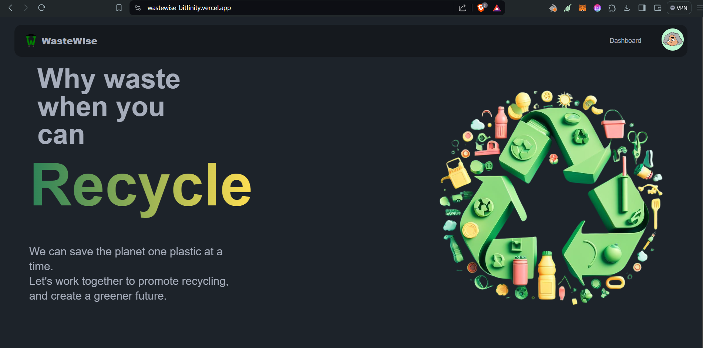
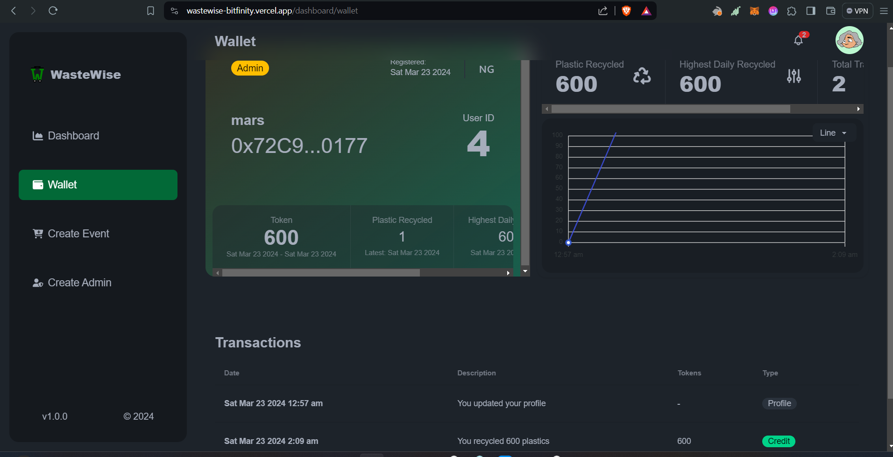
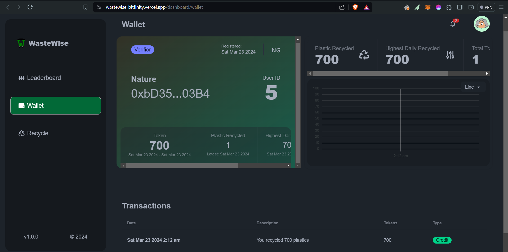
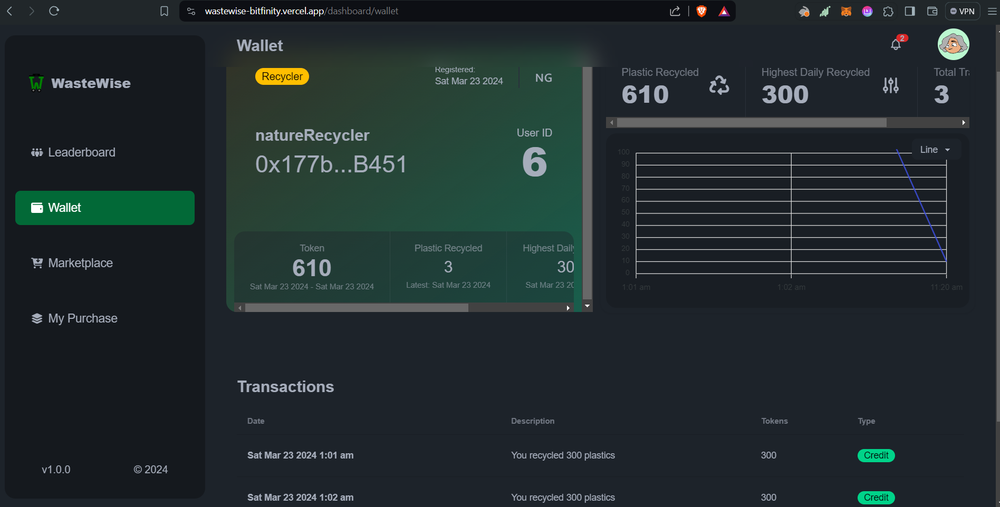
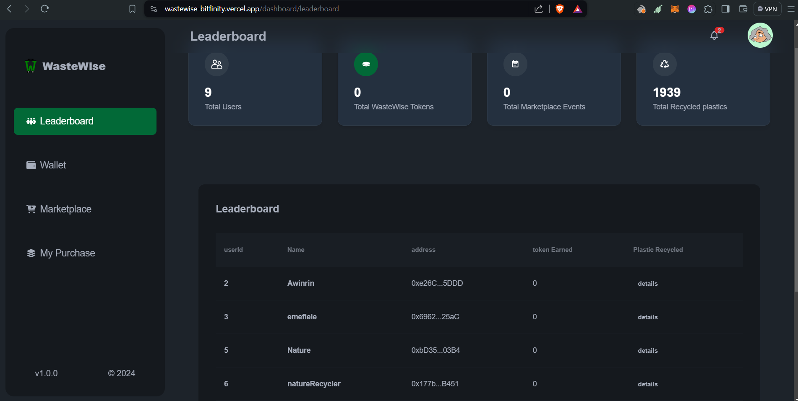
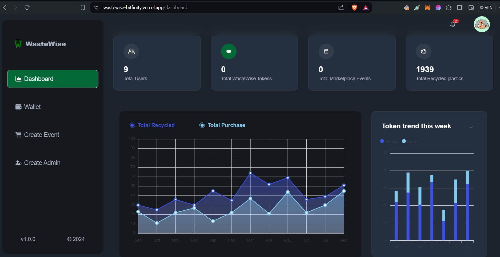
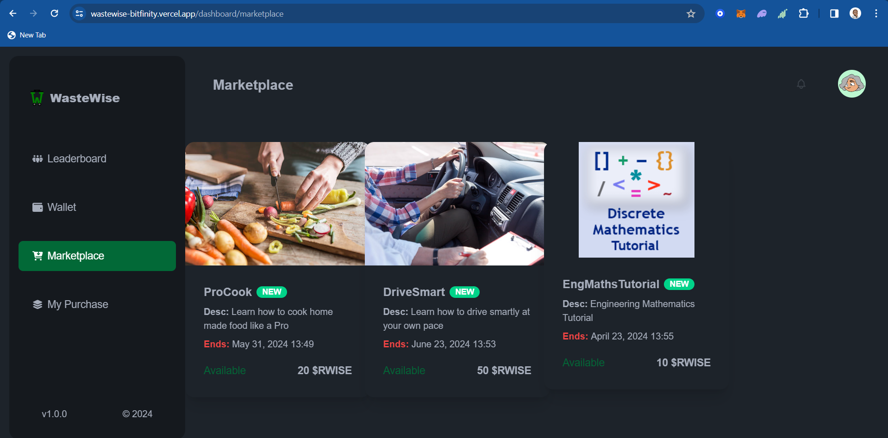

# WasteWise Protocol 

WasteWise protocol is a green chain, sustainable environment-first (Waste to Wealth) blockchain-powered platform designed to incentivize recycling and responsible waste(plastic) disposal, contributing significantly to the creation of cleaner, more sustainable environments for all.

The circular economy is at the core of our approach—reusing, and recycling plastic bottles to reduce waste in landfills.

The [WasteWise Protocol](https://wastewise-bitfinity.vercel.app/) is deployed and running on the [Bitfinity-network](https://docs.bitfinity.network/). 

The WasteWise Protocol is a comprehensive blockchain-based solution comprising three core contracts: `WasteWise`, `RwasteWise`, and `MarketPlace`. This integrated system is designed to promote environmental sustainability by rewarding users for recycling efforts through the issuance of receipt tokens (RWISE) and enabling the trade of items in a marketplace.

## Contract Addresses deployed and Verified on Bitfinity network (testnet)

- wasteWise Receipt Token Address:

  - 0x2d4dC4aDA01Bb17B1c705dd5a96E4a4CE9C9782C
    - https://explorer.bitfinity.network/address/0x2d4dC4aDA01Bb17B1c705dd5a96E4a4CE9C9782C#code

- WasteWise Address:

  - 0x989937083393431D653e8f2C0DF857FAb06bEAD0
    - https://explorer.bitfinity.network/address/0x989937083393431D653e8f2C0DF857FAb06bEAD0#code

- WasteWise MarketPlace:
  - 0x6cf0e9bEcd5dC906f0Ac3e55cCAba98ce6590241
    - https://explorer.bitfinity.network/address/0x6cf0e9bEcd5dC906f0Ac3e55cCAba98ce6590241#code

## Live Dapp URL:
https://wastewise-bitfinity.vercel.app/

## Demo Videos

Project Overview:
 - https://youtu.be/_x5AMg4C21I

Practical work through / Technical Demo 
  - https://youtu.be/oBCwbAGIKcY

## Presentation Slide
https://docs.google.com/presentation/d/1oerp7OhjaqB3_W51xEAsEXRwnI6spJzmjWMsft4wZyU/edit?usp=sharing

## UI Flows and Screens

  - Home

 - Admin Wallet

  - Verifier Wallet

  - Recycler (User) Wallet

  - LeaderBoard

  - Admin Dashbaord

  - Wastewise MarketPlace

## Further Improvements
This is the first version of our Project and the following features will be coming implemented in the second version.
- IoT Counter: 
  - The Verifer will be replaced with IoT Counter.
    - An IoT device for real time counting of the plastics bottles and sending the counts on chain to be used by the price Feeds for accurate conversion to local and cryptocurrencies.

- Account Abstraction: 
  - We are going to implement Account abstraction for easy onboarding of user and for gaseless transactions.

- Educational Forum: 
  - The educational forum will be implemented so as to raise awareness about waste management, recycling best practice for environmental sustainability. Educational videos and contents will be made available here and users will be rewarded for finishing any of the module.

- Referral System: 
  - The referral system will be implemented so as to allow users to invite their friends and also incentivize them for active referral

